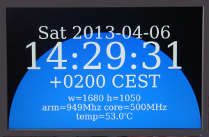

# Go RPi experiments.
### Install a bleading Go devel.
```
git clone -b gitfix git://github.com/capnm/golang.git
cd golang/src

# Nuke all garbage.
git gc --prune
git clean -fd

# Gotchas
	* It doesn't work with Go 1.0.3 release (no cgo support).
	* It doesn't work with Go tip (bug https://code.google.com/p/go/issues/detail?id=5227).

# A workaround: checkout the last good commit.
git checkout ae11ae9fd2
echo "devel gae11ae9fd2" > ../VERSION

./make.bash or ./all.bash
```
Add golang/bin to your PATH

### Install and rebuild.
```
sudo apt-get install libjpeg8-dev
git clone git://github.com/capnm/go\_rpi.git

cd go\_rpi
export GOPATH=$(pwd)
```
## Ask the Raspberry Pi GPU to draw a circle on the screen.
`go install -v circle`
and run
`bin/circle`
in the linux console (ctrl+alt+F1) or the (ssh) terminal.

## A simple "OpenVG clock" framebuffer app.
`go install -v clock`
and run
`bin/clock`



# Kudos 
	* Go OpenVG parts extracted from [ajstarks](https://github.com/ajstarks/openvg) repo.
